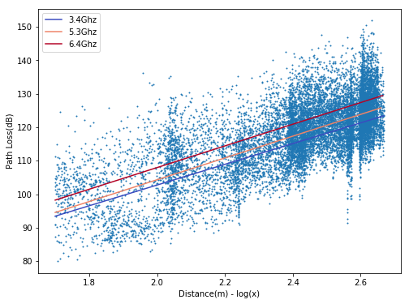
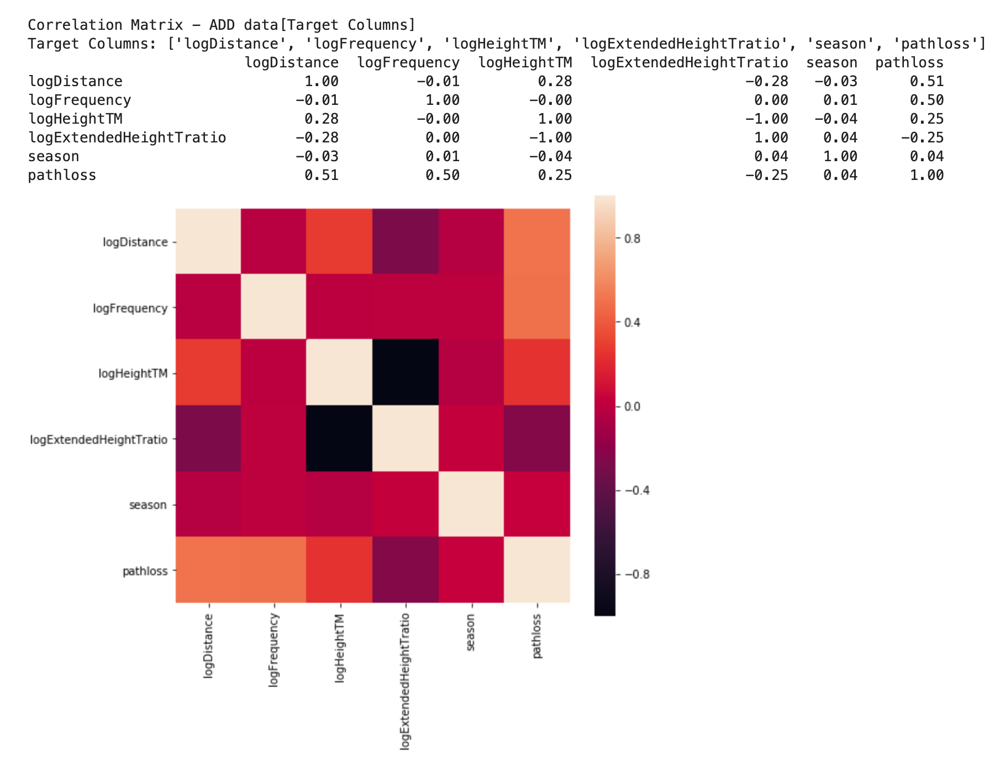
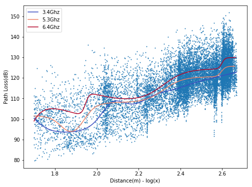
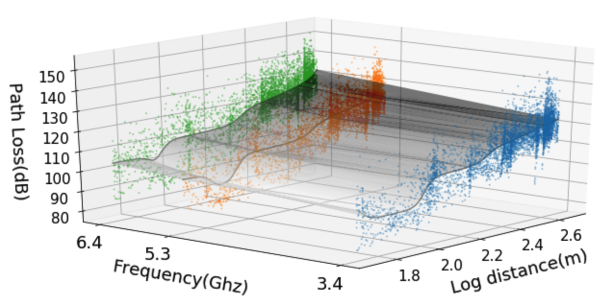
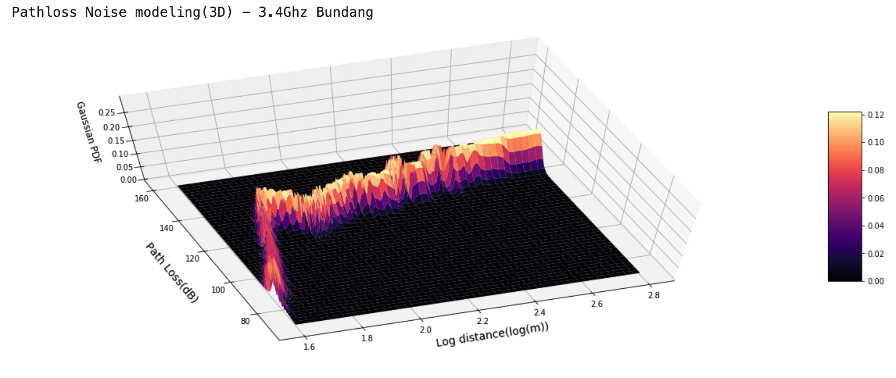
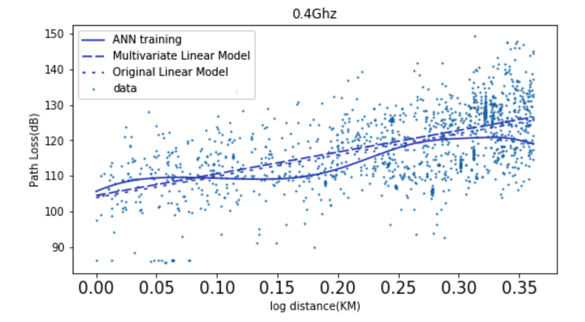

# Path Loss Modeling

This project aims for improving accurracy of existing **linear regression model**[^1] by applying a variety of machine-learning based methods.  

Although various linear log-distance path loss models have been developed, advanced models are requiring to more accurately and flexibly represent the path loss for complex environments such as the urban area. This letter proposes an artificial neural network (ANN) based multi-dimensional regres- sion framework for path loss modeling in urban environments at 3 to 6 GHz frequency band. ANN is used to learn the path loss structure from the measured path loss data which is a function of distance and frequency. The effect of the network architecture parameter (activation function, the number of hidden layers and nodes) on the prediction accuracy are analyzed. We observe that the proposed model is more accurate and flexible compared to the conventional linear model.

https://arxiv.org/abs/1904.02383

## The wireless radio propagation channel 
The object function of the modified Hata Model

>L_pathloss[dB] = L_p(d_0) + 10nlog10(d/d0) + X

which is designed for  the 1500-2000 MHz frequency range.

## The modified Hata model [^1]
The new path loss model that is revised from the modified Hata model [^1].

>L_pathloss(d) = A + B + (C + delta)log10(d) + D + delta  
>A = 46.3 + 33.9log10(f) - 13.28log10(h\_t)  
>B = -3.2 log10(11.75h_r)^2 + 4.97  
>C = 44.9 - 6.55log10(h\_t)  
>D = 0 

## Feature Engineering
Feature extraction, normalization(standard, minmax, and manual), and Filtering

## Linear Regression (Ridge, Lasso, etc)
https://github.com/chanship/pathloss/blob/master/LinearRegression/linear_regression_multidim.ipynb

## ANN Linear Regression
https://github.com/chanship/pathloss/blob/master/ANNRegression/ann_regression_multidim.ipynb

## Gaussian Process Regression
https://github.com/chanship/pathloss/blob/master/GaussianProcess/gaussian_process_noise_analysis.ipynb

## Calibrating terms in modified Hata model using multivariate linear regression
https://github.com/chanship/pathloss/blob/master/EquationModeling/EM_paju_5terms_1_8.ipynb

L_pathloss =  35.08log_d +  24.92log_f + -88.02log_hm1 + -104.14|log_(hb1/hm1)| +   2.15s + 223.10

TEST ERROR(dB)  |  RMSE | MAE | MAPE | RMSLE |  R2
---------------|----------|----------|----------|----------|----------
ANN Train   |      9.85 | 7.73 | 5.75 |  0.07 | 0.60
ANN Test    |      9.89 | 7.76 | 5.80 |  0.07 | 0.60
Linear Train  |   10.71 | 8.50  | 6.34 |  0.08 | 0.53
Linear Test    |  10.76 | 8.54  | 6.38 |  0.08 | 0.53
Diff(ANN,Linear) | 4.18 | 3.24  | 2.38 |  0.03 | 0.88

[^1]: Han-Shin Jo, and Jong-Gwan Yook. “Path Loss Characteristics for IMT-Advanced Systems in Residential and Street Environments.” IEEE Antennas and Wireless Propagation Letters 9 (2010): 867–871. Web.
